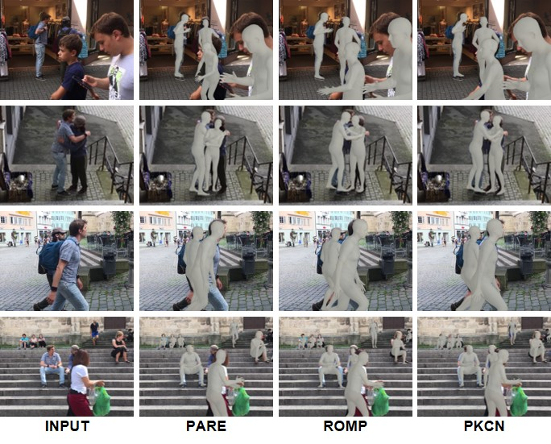

# PKCN_release 
### (The codes will be uploaded after the submitted paper is accepted)
Part-attentive Kinematic Chain-based Regressor for 3D Human Modeling

### Results of 3D human modeling on CrowdPose. From left to right: input images, PARE results, ROMP results, and PKCN results (ours). 

### Results of 3D human modeling on 3DPW. From left to right: input images, PARE results, ROMP results, and PKCN results (ours). 

