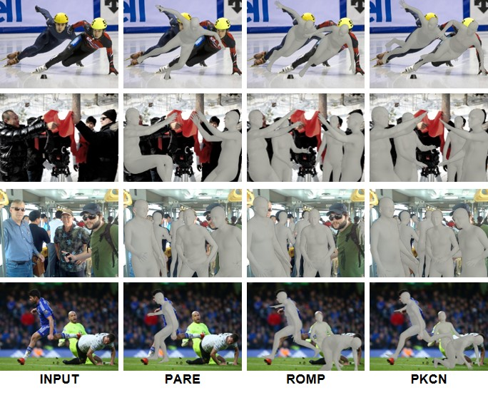

<h2 align="center">Part-attentive Kinematic Chain-based Regressor for 3D Human Modeling</h2>

<h4 align="center">(The codes will be uploaded after the submitted paper is accepted)</h4>

## Checkpoint

The Checkpoint of the proposed method is shared in [Google Drive](https://drive.google.com/drive/folders/12FSyb2jw9teOawfsUu-LC_mRzqbY667v?usp=sharing).

## Qualitative Results 

<h3 align="center">CrowdPose Dataset</h3>

<h3 align="center">3DPW Dataset</h3>

### 
